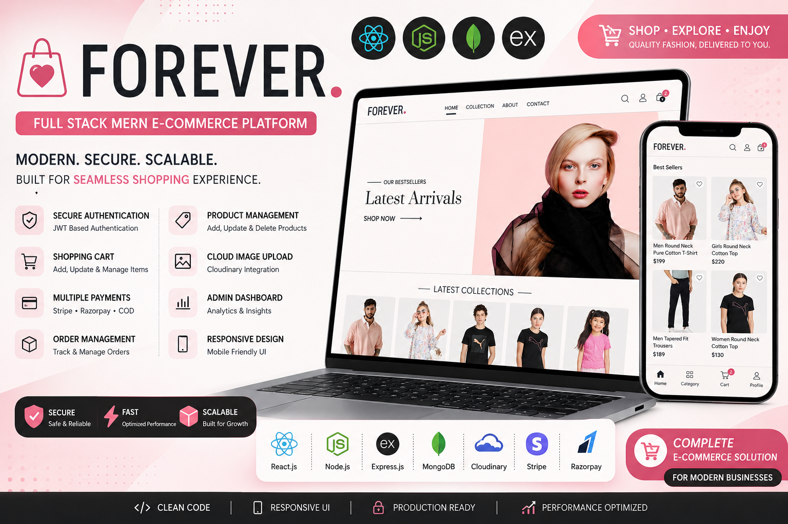

# 🛍️ Forever – Full Stack MERN E-Commerce Platform




A modern, scalable and fully responsive **MERN Stack E-Commerce Platform** featuring secure authentication, shopping cart, online payments, order management, and a complete admin dashboard.

Built using modern web technologies with production-ready architecture.

---

## 🚀 Live Demo

### Customer Website
https://forever-main-olive.vercel.app

### Admin Dashboard
https://forever-main-27xx.vercel.app

---

## 📸 Preview

> Add screenshots or GIFs here

- Home Page
- Product Details
- Shopping Cart
- Checkout
- Admin Dashboard
- Orders Page

---

# ✨ Features

## 👤 User Features

- User Registration & Login
- JWT Authentication
- Product Search & Filtering
- Product Categories
- Product Detail Page
- Shopping Cart
- Quantity Update
- Place Orders
- Order History
- Stripe Payment
- Razorpay Payment
- Responsive Design
- Mobile Friendly UI

---

## 🛒 Product Features

- Dynamic Product Listing
- Product Categories
- Best Seller Products
- Related Products
- Product Images
- Product Description
- Product Sizes
- Stock Management

---

## 🔐 Authentication

- JWT Authentication
- Protected Routes
- User Login
- Admin Login
- Secure APIs

---

## 🛠 Admin Dashboard

- Add Products
- Upload Product Images
- Delete Products
- View Products
- Manage Orders
- Update Order Status
- Dashboard Analytics

---

## 💳 Payment Integration

- Stripe
- Razorpay
- Cash On Delivery

---

## ☁️ Image Management

- Cloudinary
- Multer
- Multiple Image Upload

---

# 🏗️ Tech Stack

### Frontend

- React.js
- React Router
- Axios
- Context API
- Vite
- CSS

### Backend

- Node.js
- Express.js
- MongoDB
- Mongoose
- JWT
- Bcrypt

### Cloud

- Cloudinary

### Payments

- Stripe
- Razorpay

### Deployment

- Vercel
- Render
- MongoDB Atlas

---

# 📂 Folder Structure

```
Forever
│
├── frontend
│   ├── src
│   ├── public
│   └── package.json
│
├── backend
│   ├── config
│   ├── controllers
│   ├── middleware
│   ├── models
│   ├── routes
│   ├── server.js
│   └── package.json
│
├── admin
│   ├── src
│   └── package.json
│
└── README.md
```

---

# ⚙️ Installation

Clone Repository

```bash
git clone https://github.com/Ashu8477/forever-main.git
```

Go to Project

```bash
cd forever-main
```

Install Dependencies

### Frontend

```bash
cd frontend
npm install
```

### Backend

```bash
cd backend
npm install
```

### Admin

```bash
cd admin
npm install
```

---

# ▶️ Run Project

Frontend

```bash
cd frontend
npm run dev
```

Backend

```bash
cd backend
npm run server
```

or

```bash
npm start
```

Admin

```bash
cd admin
npm run dev
```

---

# 🔑 Environment Variables

Backend `.env`

```env
PORT=

MONGODB_URI=

JWT_SECRET=

ADMIN_EMAIL=

ADMIN_PASSWORD=

CLOUDINARY_CLOUD_NAME=

CLOUDINARY_API_KEY=

CLOUDINARY_SECRET_KEY=

STRIPE_SECRET_KEY=

RAZORPAY_KEY_ID=

RAZORPAY_KEY_SECRET=
```

Frontend `.env`

```env
VITE_BACKEND_URL=

VITE_RAZORPAY_KEY=
```

Admin `.env`

```env
VITE_BACKEND_URL=
```

---

# 📡 API Modules

- Authentication APIs
- Product APIs
- Cart APIs
- Order APIs
- Payment APIs
- User APIs

---

# 🌟 Future Improvements

- Wishlist
- Coupon System
- Product Reviews
- Email Notifications
- Inventory Management
- Sales Dashboard
- AI Product Recommendation
- Dark Mode
- Multi Vendor Support

---

# 👨‍💻 Developer

## Ashu Kumar

**Full Stack Developer (MERN)**

GitHub

https://github.com/Ashu8477

LinkedIn

https://www.linkedin.com/in/ashu-kumar-77877b289/

---

# ⭐ Support

If you like this project, don't forget to **Star ⭐ the repository**.

---

# 📄 License

This project is licensed under the **MIT License**.
